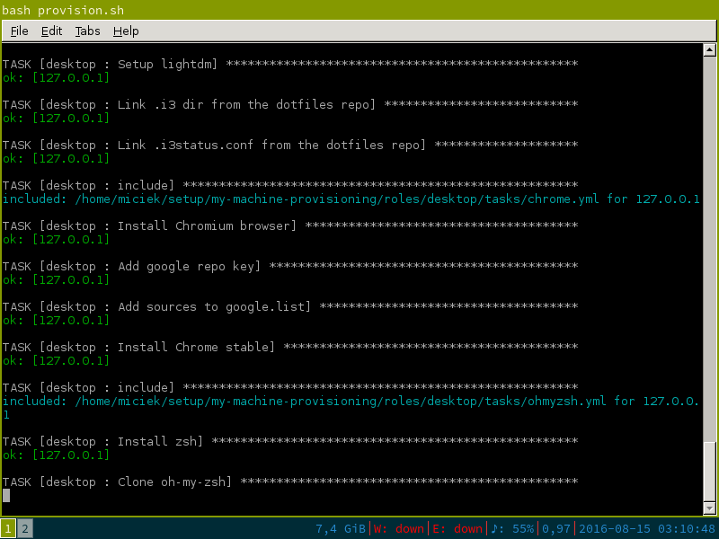

# My Machine Provisioning
Playbook that keeps my desktop configuration and provisions my perfect workstation with one command.

Execute this command on the machine which you want to provision and that's it!

```
wget -qO- https://github.com/miciek/my-machine-provisioning/raw/master/provision.sh | bash
```



## What's inside?
The playbook is divided into 2 roles: `desktop` and `development`.

`Desktop` role provisions all desktop user stuff, like:

- i3 window manager,
- oh-my-zsh,
- Source Code Pro font,
- Chrome,
- Spotify,
- mc, duplicity and other useful tools.

`Development` role provisions all programming-related stuff, like:

- Vim
- Atom,
- Docker,
- IntelliJ,
- Java,
- Scala
- Node.js
- Ruby.

... All of them with custom settings, themes and versions!

## How does it work?
The script uses [Ansible](https://www.ansible.com/) computer configuration and management platform to provision my desktop machine. My Ansible playbook uses configuration files from another repository of mine: [dotfiles](https://github.com/miciek/dotfiles).

## Why?
Ansible is used to configure and manage servers and server groups. It's very easy to learn and use. Even though it's primarily used in server environments, it proves to be very useful for me as a desktop user. It provides:

- **documentation**: My whole configuration, including installed software, steps needed to install it and versions are kept in one place.
- **backup**: I don't have to backup my system anymore, just data from my `home` directory.
- **instant provisioning**: I can provision my perfectly working environment on *any computer*, I just need to insert Live USB stick and run the command.
- **learning opportunity**: DevOps and "infrastructure as a code" are the future of software development and Ansible plays a big part in it.

## Testing
The machine can be easily provisioned from scratch using Vagrant. Just make sure you have Vagrant installed and execute `vagrant up`. Then you can use the fresh system inside VirtualBox.

## Inspiration and resources
Majority of tasks and roles in this repository are my own, but the first version was heavily inspired by [Joseph Kahn](https://blog.josephkahn.io)'s blog post: [Ansible or: How I Learned to Stop Wasting Time Setting Up My Computer and Script It](https://blog.josephkahn.io/articles/ansible/).

I also recommend visiting [Ansible docs](http://docs.ansible.com/) whenever you start using a new module.

## License
MIT
